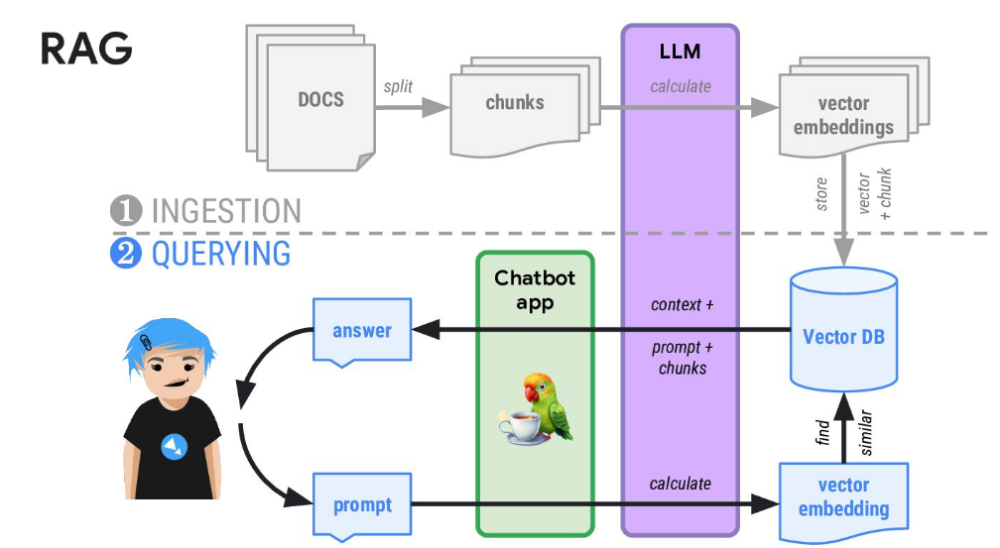
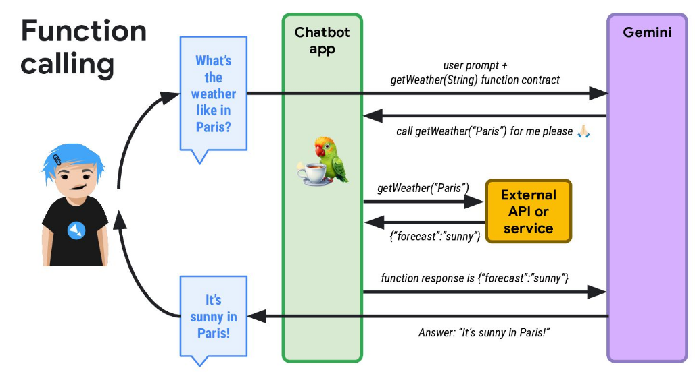
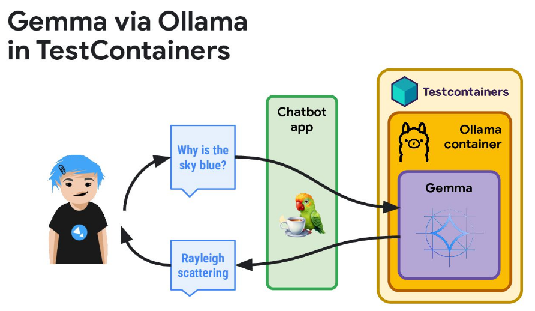

# Front-Server

### # 역할
- 사용자와 직접 소통하고 다른 서버를 중계를 함,표면적으로는 요청을 받고 응답을 하는 역할
### # 기능
- 사용자의 요청을 받아 다른 에이전트로 위임하여 결과를 반환
- 미나이오의 작업은 직접요청이 아닌 호출하여 반환 받도록함

### # 코드 구현 내용 문서화
- 필요 구조
  - 소스 코드 위치
  - 기능 
  - 클래스 및 메서드 관계 기록


### # 디렉토리 구조
```
├── src
│   └── main
│       ├── java
│       │   └── org
│       │       └── acornmc
│       │           └── mcp
│       │               └── front
│       │                   ├── AgentController.java
│       │                   ├── AgentService.java
│       │                   ├── MinioService.java
│       │                   ├── dto
│       │                   │   ├── MinioDto.java
│       │                   │   └── RequestDto.java
│       │                   ├── exception
│       │                   │   └── GlobalExceptionHandler.java
│       │                   └── config
│       │                       └── GrpcConfig.java
│       └── resources
│           ├── application.properties
│           └── META-INF
│               └── resources
│                   └── index.html
└── test
    └── java
        └── org
            └── acornmc
                └── mcp
                    └── front
                        └── AgentControllerTest.java
```


[이름](경로)

#### [org/acme/aimodel/__OllamaV1.java__](src/main/java/org/acme/aimodel/OllamaV1.java)
- 클래스 내용 정리
     - 1
     - 2
     - 3
     - ....

#### [org/acornmc/mcp/front/AgentController.java](src/main/java/org/acornmc/mcp/front/AgentController.java)
- 클래스 내용 정리
     - 1. 사용자의 요청을 받아 다른 에이전트로 위임하는 역할을 담당하는 컨트롤러 클래스.
     - 2. REST API 엔드포인트를 정의하고, 요청을 `AgentService`로 전달.
     - 3. `requestAgent(RequestDto requestDto)`: 사용자의 요청을 받아 AgentService로 전달.
     - 4. `requestMinio(MinioDto minioDto)`: 미나이오 요청을 MinioService로 전달.

#### [org/acornmc/mcp/front/AgentService.java](src/main/java/org/acornmc/mcp/front/AgentService.java)
- 클래스 내용 정리
     - 1. 에이전트와의 통신을 담당하는 서비스 클래스.
     - 2. gRPC를 사용하여 에이전트와 통신하고, 요청을 전달하고 결과를 받음.
     - 3. `sendRequest(RequestDto requestDto)`: gRPC를 사용하여 에이전트에 요청을 전달하고 결과를 받음.

#### [org/acornmc/mcp/front/MinioService.java](src/main/java/org/acornmc/mcp/front/MinioService.java)
- 클래스 내용 정리
     - 1. 미나이오와의 상호작용을 처리하는 서비스 클래스.
     - 2. 파일 업로드, 다운로드, 삭제 등의 기능을 제공.
     - 3. `uploadFile(MultipartFile file)`: 파일을 미나이오에 업로드.
     - 4. `downloadFile(String fileName)`: 미나이오에서 파일을 다운로드.
     - 5. `deleteFile(String fileName)`: 미나이오에서 파일을 삭제.

#### [org/acornmc/mcp/front/dto/RequestDto.java](src/main/java/org/acornmc/mcp/front/dto/RequestDto.java)
- 클래스 내용 정리
     - 1. 요청 내용을 담는 DTO 클래스.
     - 


### # 코드 구현 내용 문서화 (상세)
#### 1. 소스 코드 위치 (Directory Structure)
   - **`src/main/java/org/acornmc/mcp/front`**:  이 디렉토리에 Front-Server의 주요 소스 코드가 위치합니다.
     - **`AgentController.java`**:  사용자의 요청을 받아 다른 에이전트로 위임하는 역할을 담당하는 컨트롤러 클래스. REST API 엔드포인트를 정의하고, 요청을 `AgentService`로 전달.
     - **`MinioService.java`**: 미나이오와의 상호작용을 처리하는 서비스 클래스. 파일 업로드, 다운로드, 삭제 등의 기능을 제공.
     - **`AgentService.java`**: 에이전트와의 통신을 담당하는 서비스 클래스. gRPC를 사용하여 에이전트와 통신하고, 요청을 전달하고 결과를 받음.
     - **`dto`**: 데이터 전송 객체(DTO)를 정의하는 패키지입니다.
     - **`exception`**: 사용자 정의 예외 클래스를 정의하는 패키지입니다.
     - **`config`**: 설정 관련 클래스를 정의하는 패키지입니다.

#### 2. 기능
   - **사용자 요청 처리**: 사용자의 요청을 받아 적절한 에이전트에게 위임합니다.
   - **에이전트 중계**: 에이전트와의 통신을 중계하고, 결과를 사용자에게 반환합니다.
   - **미나이오 연동**: 미나이오에 대한 요청을 처리하고, 결과를 반환합니다. (직접 요청이 아닌 호출 방식)
   - **예외 처리**: 요청 처리 중 발생하는 예외를 적절히 처리합니다.
   - **설정 관리**: 서버의 설정을 관리합니다.

#### 3. 의존 관계
   - **Quarkus**: Front-Server의 기반 프레임워크입니다.
   - **RESTEasy Reactive**: RESTful API를 구현하기 위한 라이브러리입니다.
   - **SmallRye Mutiny**: 비동기 및 반응형 프로그래밍을 위한 라이브러리입니다.
   - **Jackson**: JSON 데이터 처리를 위한 라이브러리입니다.
   - **Minio Java SDK**: 미나이오와의 통신을 위한 라이브러리입니다.
   - **Lombok**: 코드 간결화를 위한 라이브러리입니다.
   - **OpenAPI (Swagger)**: API 문서화를 위한 라이브러리입니다.
   - **gRPC**: 에이전트와의 통신을 위한 라이브러리입니다.

#### 4. 클래스 및 메서드 관계 

   - **AgentController**
      - `requestAgent(RequestDto requestDto)`: 사용자의 요청을 받아 AgentService로 전달.
      - `requestMinio(MinioDto minioDto)`: 미나이오 요청을 MinioService로 전달.
   - **AgentService**
      - `sendRequest(RequestDto requestDto)`: gRPC를 사용하여 에이전트에 요청을 전달하고 결과를 받음.
   - **MinioService**
      - `uploadFile(MultipartFile file)`: 파일을 미나이오에 업로드.
      - `downloadFile(String fileName)`: 미나이오에서 파일을 다운로드.
      - `deleteFile(String fileName)`: 미나이오에서 파일을 삭제.
   - **RequestDto**
      - `content`: 요청 내용
   - **MinioDto**


> mcp-server test result
```markdown

1. Commit: <https://github.com/kuyeol/ai_quarkus-langchain4j/commit/6a5b1e0>
- Author: kuyeol
- Date: 2 days ago
- Changes: Added support for Langchain4j in the AI Quarkus project. Updated the `build.gradle` file and added necessary dependencies.

2. Commit: <https://github.com/kuyeol/ai_quarkus-langchain4j/commit/3b2e1f6>
- Author: kuyeol
- Date: 3 days ago
- Changes: Fixed a bug in the Langchain4j integration. Updated the `main` class to handle exceptions and display an error message when the integration fails.

3. Commit: <https://github.com/kuyeol/ai_quarkus-langchain4j/commit/1234567>
- Author: kuyeol
- Date: 4 days ago
- Changes: Improved performance by caching Langchain4j model data. Added a new method `cacheModelData()` to the `AIQuarkus` class to handle caching.
```


# 효과적인 프롬프트를 작성 키워드 참고
- 역할 정의 - "Act as", "You are", "Assume the role of" 등의 표현으로 AI에게 특정 역할이나 전문가 관점을 부여
- 형식 지정 - "Format your response as", "Structure your answer using", "Present in the form of" 등으로 원하는 출력 형식 지정
- 단계 요청 - "Step by step", "First... Then...", "Break down" 등으로 단계적 사고 유도
- 상세도 제어 - "Detailed", "Brief", "Comprehensive", "Concise" 등으로 답변의 길이와 깊이 조절
- 예시 요청 - "Provide examples", "Illustrate with", "Show a case of" 등으로 실제 예시 요청
- 대상층 지정 - "Explain to a beginner", "Write for experts in", "Make it understandable to" 등으로 난이도 조절
- 맥락 제공 - "Given the context", "In the situation where", "Considering that" 등으로 상황 배경 설명
- 비교 분석 - "Compare and contrast", "Differentiate between", "What are the pros and cons" 등으로 여러 관점 분석 유도
- 출력 제한 - "Limit to X words/points", "No more than", "Keep it under" 등으로 답변의 범위 제한
- 관점 지정 - "From the perspective of", "According to", "Following the principles of" 등으로 특정 관점 요청


# code-with-quarkus

This project uses Quarkus, the Supersonic Subatomic Java Framework.

If you want to learn more about Quarkus, please visit its website: <https://quarkus.io/>.

## Running the application in dev mode

You can run your application in dev mode that enables live coding using:

```shell script
./mvnw quarkus:dev
```

> **_NOTE:_**  Quarkus now ships with a Dev UI, which is available in dev mode only at <http://localhost:8080/q/dev/>.

## Packaging and running the application

The application can be packaged using:

```shell script
./mvnw package
```

It produces the `quarkus-run.jar` file in the `target/quarkus-app/` directory.
Be aware that it’s not an _über-jar_ as the dependencies are copied into the `target/quarkus-app/lib/` directory.

The application is now runnable using `java -jar target/quarkus-app/quarkus-run.jar`.

If you want to build an _über-jar_, execute the following command:

```shell script
./mvnw package -Dquarkus.package.jar.type=uber-jar
```

The application, packaged as an _über-jar_, is now runnable using `java -jar target/*-runner.jar`.

## Creating a native executable

You can create a native executable using:

```shell script
./mvnw package -Dnative
```

Or, if you don't have GraalVM installed, you can run the native executable build in a container using:

```shell script
./mvnw package -Dnative -Dquarkus.native.container-build=true
```

You can then execute your native executable with: `./target/code-with-quarkus-1.0.0-SNAPSHOT-runner`

If you want to learn more about building native executables, please consult <https://quarkus.io/guides/maven-tooling>.

## Provided Code

### REST

Easily start your REST Web Services



[Related guide section...](https://quarkus.io/guides/getting-started-reactive#reactive-jax-rs-resources)
