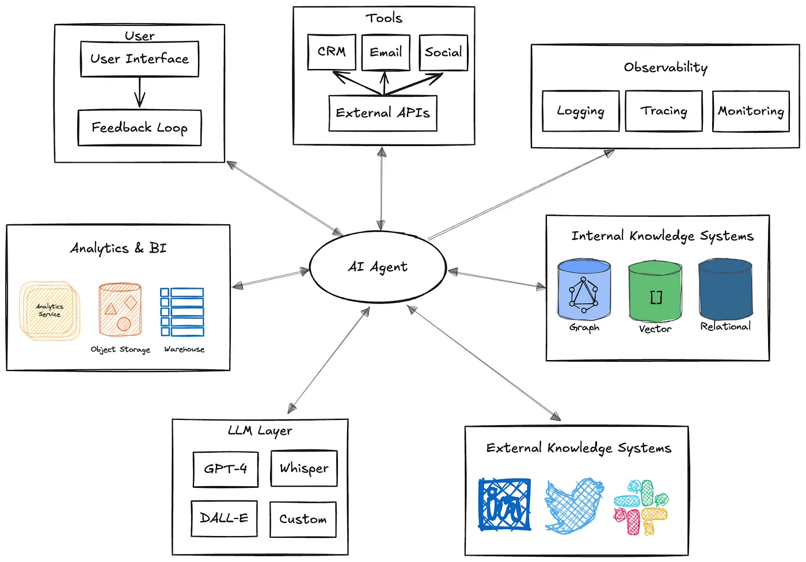
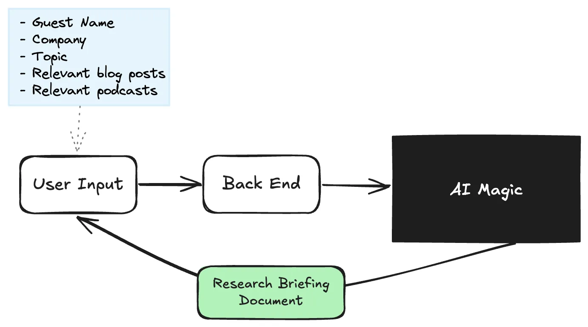
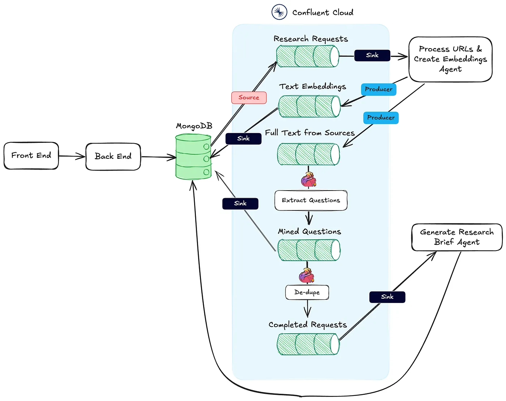
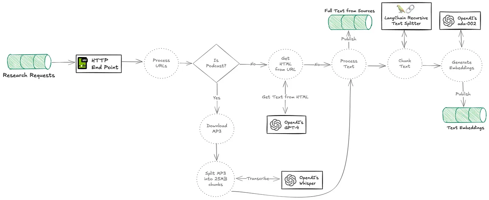
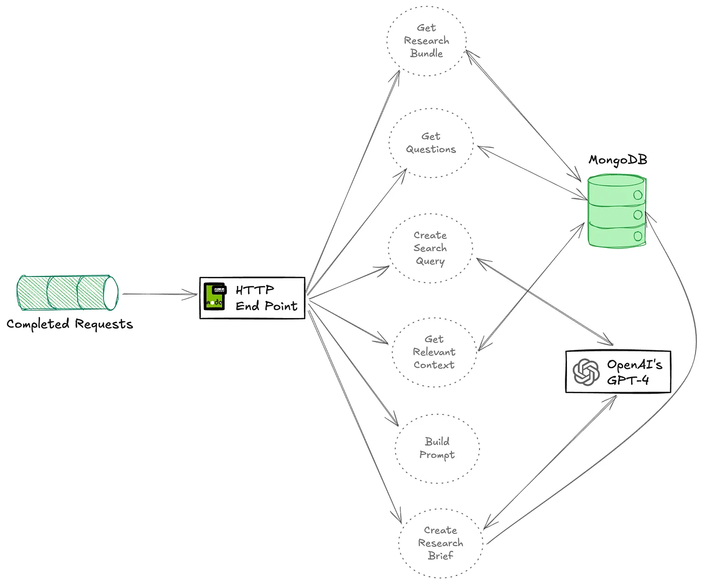

  
# N+1 쿼리 문제 
```
@NamedQuery(name="getRealmUserByUsername", query="select u from UserEntity u where u.username = :username and u.realmId = :realmId")
```
> 관계 없음

## 락모드 사용 
> N+1조인 문제 해결
`LockModeType.PESSIMISTIC_WRITE`


@JoinColumn(name = "USERENTITY_ID")


__https://shiftasia.com/community/kafka-and-intergrate-with-quarkus__


# // TODO : 
- Database Entity Structure 
- Request-> Incomming : return -> Outgoing -> Response
- adaptive -> adaptive ->
- Mendel ,  DNA . (AA , aa ) -> Aa : A

# 에이전트 생성

테이블에서 에이전트 정보 호출 후 에이전트 생성시 아이디를 부여하여 기록 관리


# 에이전트 로직 분류

1. 명세 정의
  -  api로 정의 
2. 명세를 분류해 에이전트에게 전달 
3. 테스트 에이전트 추가








출처:https://seanfalconer.medium.com/event-driven-ai-building-a-research-assistant-with-kafka-and-flink-e95db47eb3f3


# 추가
- 생성 요청마다 결과는 다름
- 여러번 요청시행 후 -> 확률이 높은 답변이 신뢰도 높을수도?
- 양자 원리로??... 중첩답변은?... 한번에 동일 명령을 여러개 요청
- 서로 다른 모델에게 동일한 질문을 던지고 응답 비교

모델마다 학습 데이터, 파라미터 튜닝, 추론 방식 등이 다름

다양한 시각에서 해결책을 찾을 수 있음

🔹 장점:
✅ 다양한 접근 방식으로 해결책 도출 가능 → 편향 줄이기 가능
✅ 특정 모델이 틀린 답을 주더라도 다른 모델이 보완 가능
✅ 다양한 지식을 결합할 수 있음 (예: GPT, Claude, Gemini 비교)

🔸 단점:
❌ 일관성이 떨어질 수 있음 → 모델마다 스타일이 다름
❌ 모델 간 정확도 차이로 인해 품질이 균등하지 않을 수 있음
❌ 서로 다른 모델 간 출력 포맷이 다를 수 있음 → 통합 필요


Quarkus Kafka/Panache Reactive Quickstart
=========================================

This project illustrates how you can interact with Apache Kafka using MicroProfile Reactive Messaging and Hibernate with Panache.
The project uses:

* RESTEasy Reactive
* Reactive Messaging and its connector for Kafka
* Hibernate Reactive with Panache

_NOTE:_ The [kafka-panache-quickstart](../kafka-panache-quickstart) provides the same example but using _classic_ Hibernate.

## Start the application

Start the application in dev mode with:

```bash
mvn quarkus:dev
```

_NOTE:_ Quarkus Dev Services starts the database and Kafka broker automatically.

Then, open your browser to `http://localhost:8080/prices`, and you should get the set of prices written in the database.
Every 5 seconds, a new price is generated, sent to a Kafka topic, received by a Kafka consumer, and written to the database.
Refresh the page to see more prices.

## Anatomy

* `PriceGenerator` - a bean generating random price. They are sent to a Kafka topic.
* `PriceStorage` - on the consuming side, the `PriceStorage` receives the Kafka message and write it into the database using Hibernate with Panache
* `PriceResource`  - the `PriceResource` retrieves the prices from the database and send them into the HTTP response

## Running in native

You can compile the application into a native binary using:

`mvn clean install -Pnative`

As you are not in dev or test mode, you need to start a PostgreSQL instance and a Kafka broker.
To start them, just run `docker-compose up -d`.

Then, run the application with:

`./target/kafka-panache-reactive-quickstart-1.0.0-SNAPSHOT-runner` 
