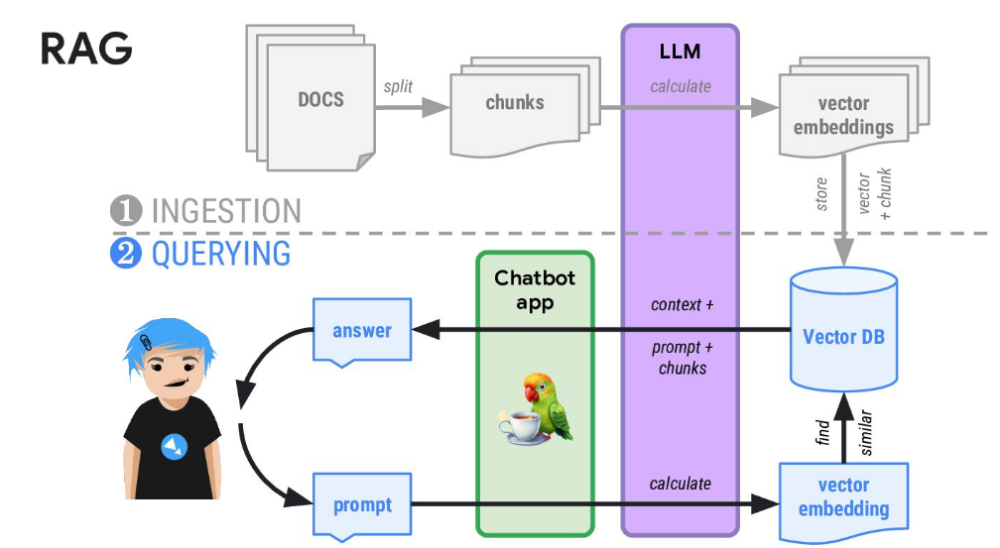
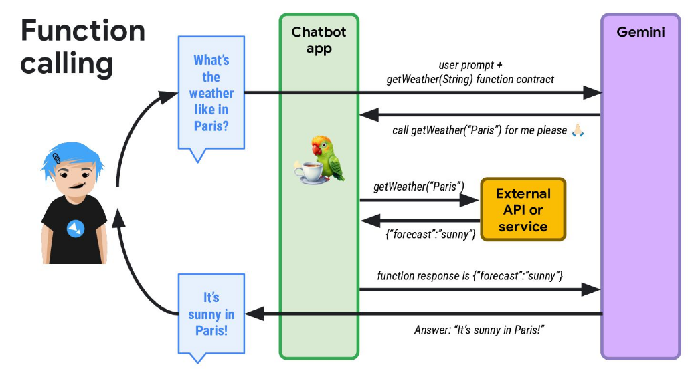
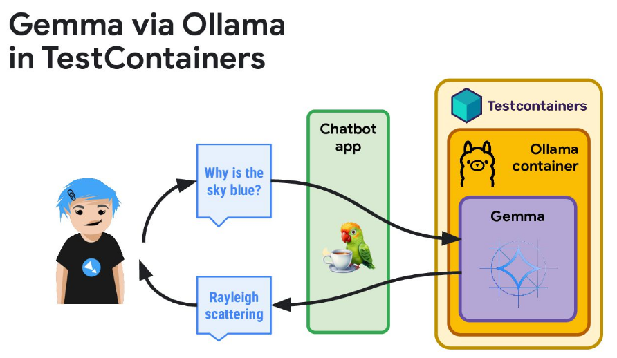

1. Commit: <https://github.com/kuyeol/ai_quarkus-langchain4j/commit/6a5b1e0>
  - Author: kuyeol
  - Date: 2 days ago
  - Changes: Added support for Langchain4j in the AI Quarkus project. Updated the `build.gradle` file and added necessary dependencies.

2. Commit: <https://github.com/kuyeol/ai_quarkus-langchain4j/commit/3b2e1f6>
  - Author: kuyeol
  - Date: 3 days ago
  - Changes: Fixed a bug in the Langchain4j integration. Updated the `main` class to handle exceptions and display an error message when the integration fails.

3. Commit: <https://github.com/kuyeol/ai_quarkus-langchain4j/commit/1234567>
  - Author: kuyeol
  - Date: 4 days ago
  - Changes: Improved performance by caching Langchain4j model data. Added a new method `cacheModelData()` to the `AIQuarkus` class to handle caching.


# 효과적인 프롬프트를 작성 키워드 참고
- 역할 정의 - "Act as", "You are", "Assume the role of" 등의 표현으로 AI에게 특정 역할이나 전문가 관점을 부여
- 형식 지정 - "Format your response as", "Structure your answer using", "Present in the form of" 등으로 원하는 출력 형식 지정
- 단계 요청 - "Step by step", "First... Then...", "Break down" 등으로 단계적 사고 유도
- 상세도 제어 - "Detailed", "Brief", "Comprehensive", "Concise" 등으로 답변의 길이와 깊이 조절
- 예시 요청 - "Provide examples", "Illustrate with", "Show a case of" 등으로 실제 예시 요청
- 대상층 지정 - "Explain to a beginner", "Write for experts in", "Make it understandable to" 등으로 난이도 조절
- 맥락 제공 - "Given the context", "In the situation where", "Considering that" 등으로 상황 배경 설명
- 비교 분석 - "Compare and contrast", "Differentiate between", "What are the pros and cons" 등으로 여러 관점 분석 유도
- 출력 제한 - "Limit to X words/points", "No more than", "Keep it under" 등으로 답변의 범위 제한
- 관점 지정 - "From the perspective of", "According to", "Following the principles of" 등으로 특정 관점 요청


# code-with-quarkus

This project uses Quarkus, the Supersonic Subatomic Java Framework.

If you want to learn more about Quarkus, please visit its website: <https://quarkus.io/>.

## Running the application in dev mode

You can run your application in dev mode that enables live coding using:

```shell script
./mvnw quarkus:dev
```

> **_NOTE:_**  Quarkus now ships with a Dev UI, which is available in dev mode only at <http://localhost:8080/q/dev/>.

## Packaging and running the application

The application can be packaged using:

```shell script
./mvnw package
```

It produces the `quarkus-run.jar` file in the `target/quarkus-app/` directory.
Be aware that it’s not an _über-jar_ as the dependencies are copied into the `target/quarkus-app/lib/` directory.

The application is now runnable using `java -jar target/quarkus-app/quarkus-run.jar`.

If you want to build an _über-jar_, execute the following command:

```shell script
./mvnw package -Dquarkus.package.jar.type=uber-jar
```

The application, packaged as an _über-jar_, is now runnable using `java -jar target/*-runner.jar`.

## Creating a native executable

You can create a native executable using:

```shell script
./mvnw package -Dnative
```

Or, if you don't have GraalVM installed, you can run the native executable build in a container using:

```shell script
./mvnw package -Dnative -Dquarkus.native.container-build=true
```

You can then execute your native executable with: `./target/code-with-quarkus-1.0.0-SNAPSHOT-runner`

If you want to learn more about building native executables, please consult <https://quarkus.io/guides/maven-tooling>.

## Provided Code

### REST

Easily start your REST Web Services



[Related guide section...](https://quarkus.io/guides/getting-started-reactive#reactive-jax-rs-resources)
